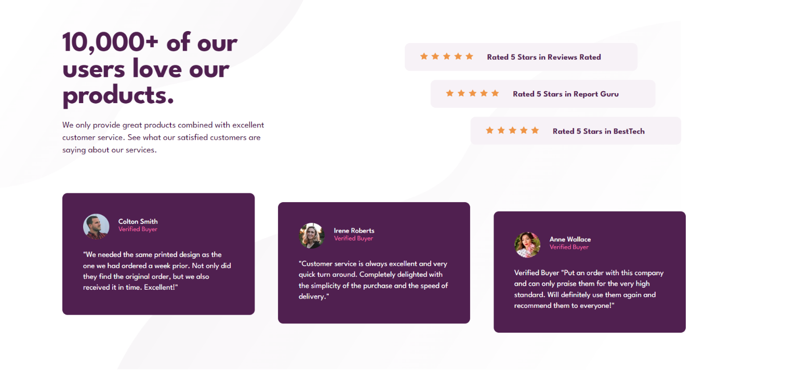

## Table of contents

- [Overview](#overview)
  - [The challenge](#the-challenge)
  - [Screenshot](#screenshot)
  - [Links](#links)
- [My process](#my-process)
  - [Built with](#built-with)
- [Author](#author)

## Overview

### The challenge

Users should be able to:

- View the optimal layout for the section depending on their device's screen size

### Screenshot

### Links

- Solution URL: [Click Here!](https://github.com/APdev88/frontend-mentor-social-proof-section)
- Live Site URL: [Click Here!](https://social-proof-section-ap.netlify.app/)

## My process

### Built with

- Semantic HTML5 markup
- CSS custom properties
- Flexbox
- Sass
- [JavaScript](https://developer.mozilla.org/en-US/docs/Web/JavaScript)

## Author

- Frontend Mentor - [@alessiopisanoweb](https://www.frontendmentor.io/profile/alessiopisanoweb)
- Twitter - [@ap\_\_dev](https://twitter.com/ap__dev)
